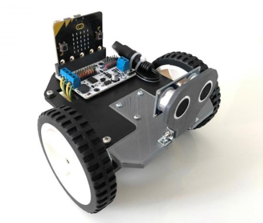
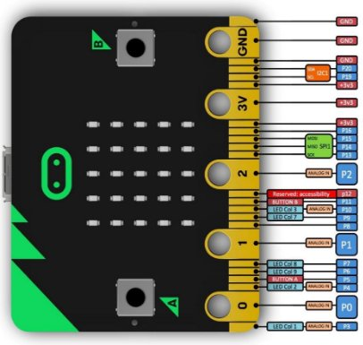
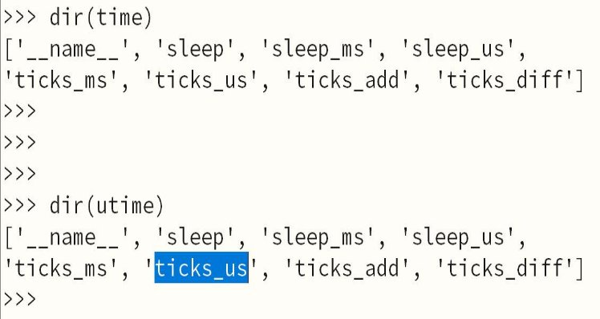

# Commande d’un robot à deux roues

# Évitement d’obstacles

**Capteur US HC-SR04**

*Trigger – pin13 ECHO – pin14*

**Evitement d’obstacles**

Nous expérimenterons l’évitement d’obstacles sur le robot à deux roues. Ce mobile sans pilote à bord peut être équipé du capteur à ultrasons HC-SR04 pour effectuer des mesures de distances.

Le capteur est constitué d'un émetteur et d'un récepteur d'ultrasons. La distance parcourue par les ondes ultrasonores est proportionnelle à la durée du parcours. C’est sur ce principe qu’est basé le fonctionnement du capteur.

**Mesure de distance avec le HC-SR04**

Les liaisons avec le microcontrôleur sont effectuées à l’aide deux broches physiques : l’entrée de commande **Trigger** et la sortie du signal de retour (**Echo**).

Le principe de la mesure de distance est le suivant :

- Une impulsion de durée 10ms appliquée à l’entrée Trigger provoque l’envoi dans l’atmosphère d’un train de 8 ondes ultra-sonores de fréquence 40kHz.
- La sortie Echo se met alors à l’état logique 1 et le restera jusqu’à ce qu’un objet soit détecté. La durée de cette impulsion positive est proportionnelle à la distance parcourue par les ondes ultra-sonores.
- On montre facilement que la distance**d** est obtenue par la relation

**d = duree\_ECHO \* Cair / 2**

**La méthode d’évitement simple**

Pour notre application, les liaisons avec la carte micro:bit sont les suivantes :

- le signal de commande arrivant sur l’entrée ***Trigger*** est généré par***pin13***,
- le signal de sortie ***ECHO*** est lu sur ***pin14***.
- les moteurs du robot sont commandés respectivement par [*pin8* (sens)/*pin1* (vitesse)] et [*pin12* (sens)/*pin2* (vitesse)].

La tâche d’évitement d’obstacle est une boucle infinie qui doit obéir aux contraintes suivantes :

- Le robot doit avancer lorsque la distance mesurée est supérieure à 20cm,
- Dans le cas contraire, il doit amorcer un pivotement vers la gauche.

Il est à remarquer que dans cet algorithme relativement simple le robot se remettra naturellement à avancer lorsqu’une « fenêtre libre (aucun obstacle à moins de 20cm) »est observée.

Écrire un programme d’évitement d’obstacles basé sur la méthode simple présentée ci-dessus. Il sera nécessaire de créer des fonctions de gestion des mouvements élémen- taires du robot comme :

- ***robotAvance(***vitesse***)***,
- ***robotPivote(***vitesse**,** sens**),
- ***robotStoppe()***.

**Comment procéder**

1. Proposer votre méthode sous forme de pseudo-code.
1. Traduire votre algorithme en micropython.

**ANNEXES – time et utime**

ATTENTION: On utilisera la bibliothèque ***utime*** (ou***time***) dans la fonction de mesure de distance.

NB : la fonction ***time\_pulse\_us()*** est interdite parce qu’il vous est demandé de construire vous-même la mesure de l’écho.

[**Brochage de la carte micro:bit**](https://microbit.org/guide/python/)

